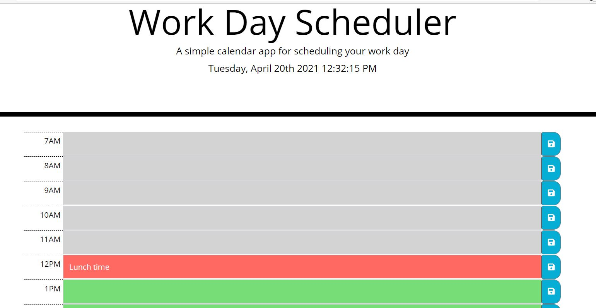

## 
 📆Workday Scheduler

---

The **Workday Scheduler** is an application to put appointments into a daily web-based calendar. This application has been partially started and needs to be completed based on the criteria below.

---

## 📋 Criteria

- The application will contain timeblocks and a save button for each block.
- The timeblocks will allow a text entry to be put in and saved to local storage.
- When the page is refreshed, the appointment text will persist in the correct timeblock.
- The application will display the current date in the header.
- The current hour timeblock will have it's own unique background color.
- Timeblocks prior to the current hour and after the current hour will have a different background color.
- The application will use Moment.js for it's time functions.

---

## 1️⃣ Steps used

1. Modified the existing HTML file by adding Bootstrap based input groups for the timeblocks.
2. Added classes to these new groups for custom styling.
3. Added unique id's for the buttons and textarea fields.
4. Added icons to the save buttons using Fontawesome fonts.
5. Added a custom js file, included variables and functions to work with moment.js for all date and time formats.
6. Created functions for 2 time intervals, saving and retrieving from local storage and to add and remove classes for background colors.

Final results: [Workday Scheduler](https://malmason.github.io/workday-scheduler/)

---

## 📸 Screenshots

**Scheduler Home Screen**

## 📱 Contact

Malcolm Mason - [Github](https://github.com/malmason) Email: [Malcolm](mailto:malmason66@gmail.com) 📧

---

&copy; 2021 Malcolm Mason
